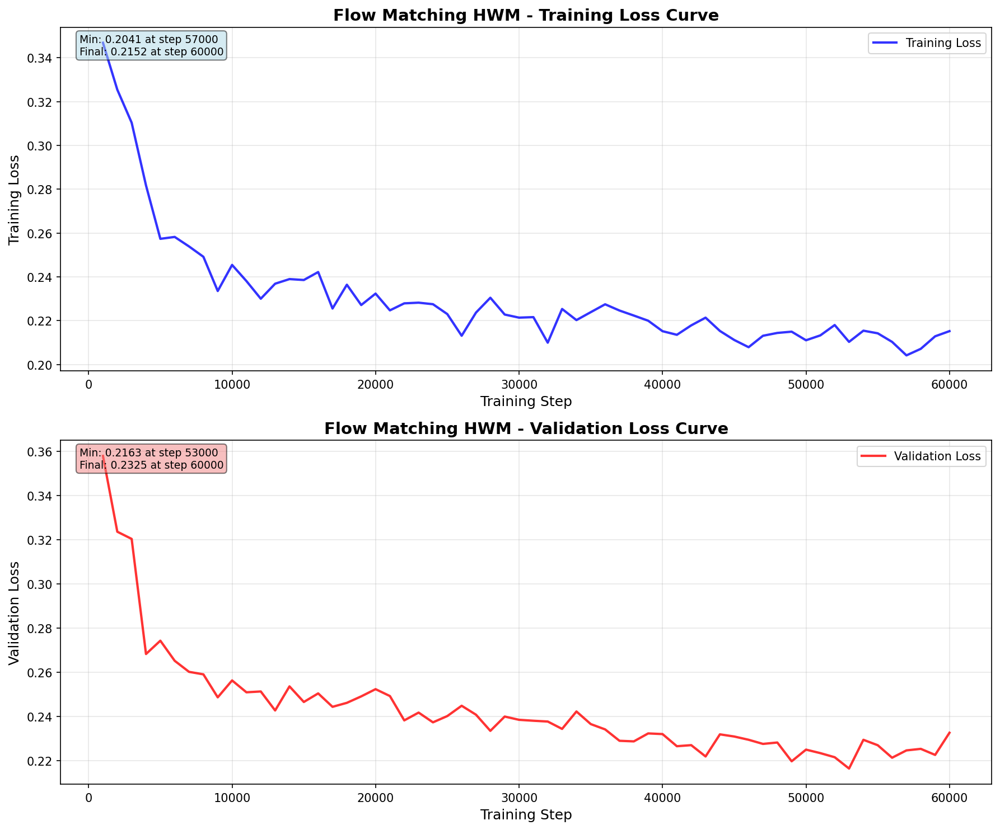
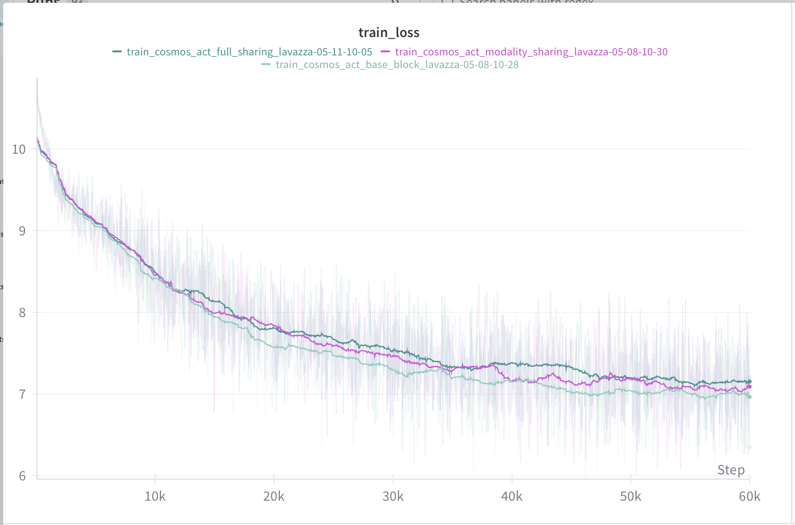
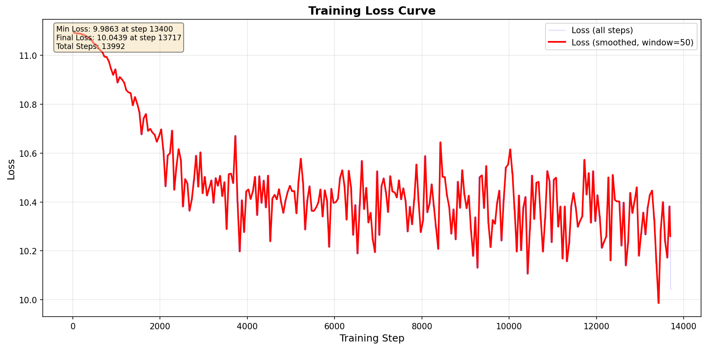

# Masked-HWM: Masked Humanoid World Model with Shared Parameters

Implementation of Masked-HWM (Masked Humanoid World Model) with shared parameters, following the specifications from the Humanoid World Models paper.

## Flow Matching Model Output

### Prediction


### Noise Schedule


### Comparison


## Masked Flow Model Output

Output from the Masked model:


## Loss Curve Comparison

> **Note:** The model size is much smaller than the paper implementation due to limited GPU access.

### Author Implementation

#### Flow HWM Loss


#### Experimental Flow Loss


#### Masked HWM Loss


#### Experimental Mask Loss


## Pre-trained Checkpoints

Pre-trained model checkpoints are available on Hugging Face: [sangramrout/Humanoid_WM](https://huggingface.co/sangramrout/Humanoid_WM)

### Masked HWM Checkpoint

- **Checkpoint**: `checkpoint-60000`
- **Location**: `Masked HWM/checkpoint-60000/`
- **Download**: Available on Hugging Face repository

### Flow HWM Checkpoint

- **Checkpoint**: `checkpoint-24000`
- **Location**: `checkpoints_flow_hwm_medium/checkpoint-24000/`
- **Download**: Available on Hugging Face repository

### Downloading Checkpoints

You can download the checkpoints using the Hugging Face Hub:

```python
from huggingface_hub import snapshot_download

# Download Masked HWM checkpoint
masked_checkpoint = snapshot_download(
    repo_id="sangramrout/Humanoid_WM",
    allow_patterns="Masked HWM/checkpoint-60000/*"
)

# Download Flow HWM checkpoint
flow_checkpoint = snapshot_download(
    repo_id="sangramrout/Humanoid_WM",
    allow_patterns="checkpoints_flow_hwm_medium/checkpoint-24000/*"
)
```

Or using the command line:

```bash
# Install huggingface_hub if needed
pip install huggingface_hub

# Download using CLI
huggingface-cli download sangramrout/Humanoid_WM --local-dir ./checkpoints
```
